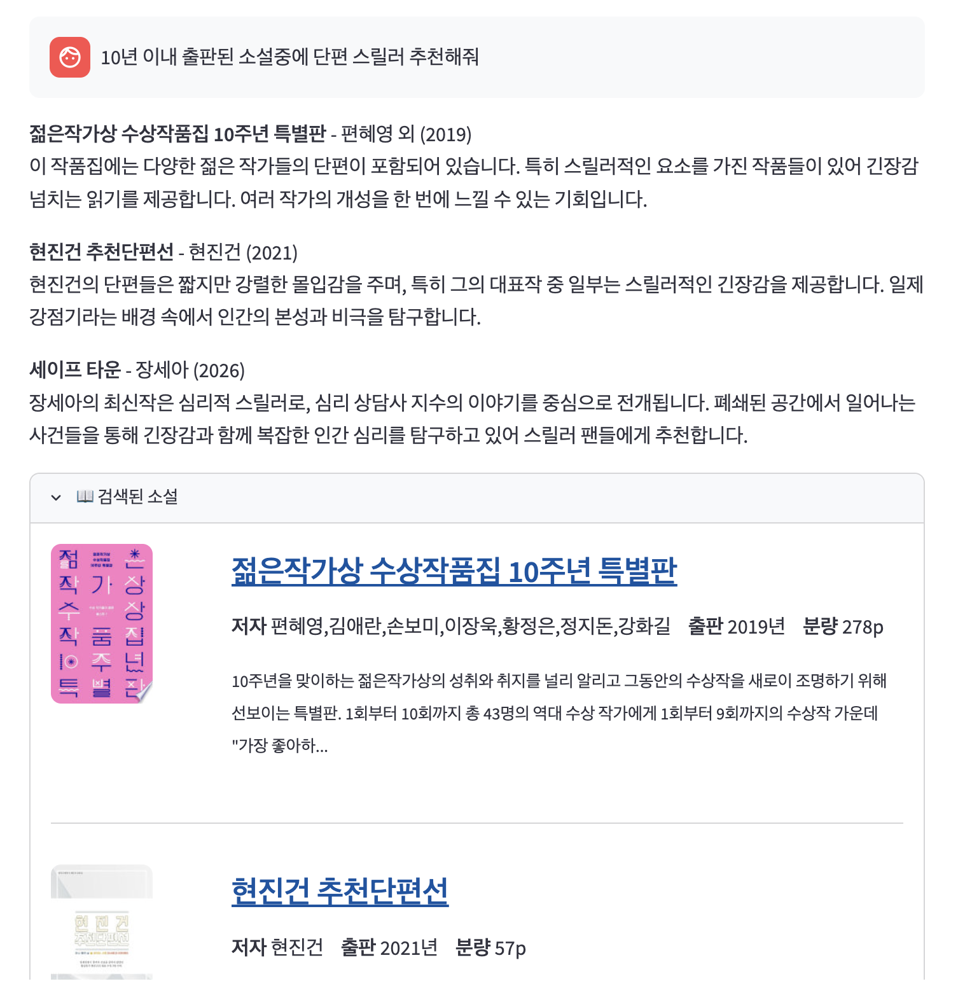

# 📚 Azure Korean Novel RAG


> Azure 기반 한국 소설 하이브리드 검색 + AI 추천 시스템

키워드나 장르, 세부사항을 입력하면 Azure AI Search의 하이브리드 검색(벡터 + 키워드)으로 소설을 찾고,  
Azure OpenAI GPT-4o-mini가 왜 이 소설을 추천하는지 설명해줍니다.

---

## 아키텍처

~~Kakao Books API~~ / ~~알라딘 API~~ / Google Books API (데이터 수집)  
→ Azure Blob Storage (`novels_raw.json`)  
→ Azure OpenAI `text-embedding-3-small` (임베딩)  
→ Azure AI Search (HNSW 벡터 + `ko.microsoft` 한국어 형태소 인덱스)  
→ Streamlit 앱 + Azure OpenAI `gpt-4o-mini` (스트리밍 추천)

---

## 기술 스택

| 영역 | 기술 |
| --- | --- |
| 데이터 수집 | ~~Kakao Books API~~, ~~알라딘 Open API~~, Google Books API |
| 저장소 | Azure Blob Storage |
| 임베딩 | Azure OpenAI `text-embedding-3-small` |
| 검색 | Azure AI Search (HNSW 벡터 + `ko.microsoft` 형태소) |
| 생성 | Azure OpenAI `gpt-4o-mini` (스트리밍) |
| UI | Streamlit |

---

## 프로젝트 구조

```
.
├── notebooks/
│   ├── 01_data_collection.ipynb          # 카카오 Books API 수집 (미사용)
│   ├── 01_data_collection_Aladin.ipynb   # 알라딘 API 수집 (미사용)
│   ├── 01_data_collection_Google.ipynb   # Google Books API + Azure Blob 저장
│   └── 02_indexing.ipynb                 # 임베딩 생성 + Azure AI Search 인덱스 구축
├── src/
│   └── app.py                            # Streamlit 챗봇 앱
├── docs/
│   └── CONTRIBUTING.md                   # 기여 가이드
├── requirements.txt
└── .env.example                          # 환경변수 템플릿
```

---

## 시작하기

### 1. 환경 변수 설정

```
cp .env.example .env
# .env 파일을 열어 각 API 키를 입력하세요
```

| 변수 | 설명 |
| --- | --- |
| `GOOGLE_BOOKS_API_KEY` | Google Books API 키 |
| `AZURE_STORAGE_CONNECTION_STRING` | Azure Storage 연결 문자열 |
| `AZURE_STORAGE_CONTAINER` | Blob 컨테이너 이름 (기본값: `novels`) |
| `AZURE_SEARCH_ENDPOINT` | Azure AI Search 엔드포인트 |
| `AZURE_SEARCH_ADMIN_KEY` | Azure AI Search Admin 키 |
| `AZURE_OPENAI_ENDPOINT` | Azure OpenAI 엔드포인트 |
| `AZURE_OPENAI_API_KEY` | Azure OpenAI API 키 |
| `AZURE_OPENAI_EMBEDDING_DEPLOYMENT` | 임베딩 배포 이름 |
| `AZURE_OPENAI_CHAT_DEPLOYMENT` | 채팅 배포 이름 |

### 2. 의존성 설치

```
python -m venv .venv
source .venv/bin/activate  # Windows: .venv\Scripts\activate
pip install -r requirements.txt
```

### 3. 데이터 수집 → 인덱싱

`notebooks/` 폴더에서 순서대로 실행하세요.

```
1. notebooks/01_data_collection_Google.ipynb   # 데이터 수집 + Blob 업로드
2. notebooks/02_indexing.ipynb                 # 임베딩 + 인덱스 구축
```

### 4. 앱 실행

```
streamlit run src/app.py
```

---
## 실행 화면



## 주요 기능

### 하이브리드 검색

Azure AI Search의 벡터 검색(의미 유사도)과 BM25 키워드 검색을 결합해  
"가족 갈등 현대소설" 같은 자연어 쿼리에도 정확한 결과를 반환합니다.

### 장르 버튼

판타지 / 스릴러 / 로맨스 / 역사소설 / 성장소설 / 가족드라마 / 사회비판 / 힐링 / SF / 공포  
버튼 한 번으로 해당 장르 추천을 바로 받을 수 있습니다.

### 스트리밍 응답

GPT-4o-mini가 검색된 소설 목록을 기반으로 추천 이유를 스트리밍으로 설명합니다.  
검색된 소설 목록만 참고하도록 프롬프트를 제한해 할루시네이션을 방지합니다.

---

## 추천 동작 규칙

| 항목 | 동작 |
| --- | --- |
| 관련 소설 없음 | 카드 미표시, "관련 소설 없음" 응답 |
| 관련 소설 1~2개 | 관련 있는 것만 표시 (3개 강제 미포함) |
| 출판 기간 조건 | "5년 이내" 등 쿼리 → AI Search 필터로 기간 외 제외 |
| 대화 기억 | 최근 3턴만 GPT 컨텍스트에 포함 |
| 소설 링크 | 제목 클릭 → 알라딘 검색 (ISBN 우선, 없으면 제목) |
| 임베딩 시점 | 인덱싱 1회 생성, 이후 사용자 입력만 매 요청 임베딩 |

---

## 데이터 수집 제한 사항

Google Books API는 한국 소설 데이터가 완전하지 않을 수 있습니다.  
특히 `keywords` 필드는 API에서 제공하지 않아 `summary`와 `category`로 대체합니다.  
국립도서관 Open API 또는 알라딘 Open API 승인 시 데이터 교체를 권장합니다.

---

## 라이선스

MIT
